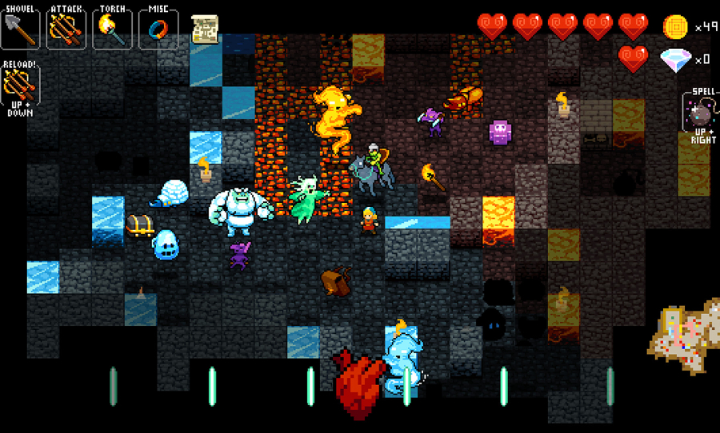

# j05

请将j04的迷宫任务改造为一个ruguelike的葫芦娃与妖精两方对战游戏，游戏如下图所示。

需求如下：

- 每个生物体都是一个线程
- 每个生物体的移动、攻击等行为决策可使用Minimax或其他算法（可参考https://www.baeldung.com/java-minimax-algorithm）
- 请特别注意线程race condition（两个生物体不能占据同一个tile，对同一生物体的两个攻击行为应该先后发生作用，等）
- 请发挥想象力
- 完成后录屏发qq群或小破站

